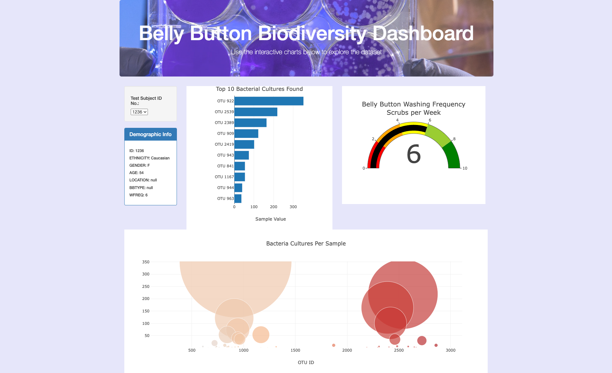

# Belly Button Biodiversity

An interactive [dashboard](https://alydavis.github.io/index.html) exploring Belly Button Biodiversity data.

## About the Project
The human body is home to many different types of bacteria, with a single belly button housing up to 100 different species. With so much data across hundreds of particpants, what is the best way to visualize the types of bacteria in the body? This project utilizes a sample data set from belly button bacteria. (Data source: ) The JSON data is parsed and transformed with JavaScript, and an interactive HTML dashboard displays the results. 

## Tools and Resources
- JavaScript
- Plotly JavaScript visualization library
- D3.json to fetch exernal data
- Deployed on GitHub pages

## Data Processing
Parse data in JSON format
Manipulate, parse, and transform data
Retrive data from external sources - CSV, APIs

The map() method in JavaScript applies a transformation to each element in an array.

Use functional programming in JavaScript to manipulate data
Use JavaScript's Math library to manipulate numbers
Use event handlers in JavaScript to add interactivity to a data visualization
How to use interactivity to enhance your visualizations. Interactive features like buttons and drop down menus

## Dashboard
It is important that the final visualization is engaging, dynamic, and easy to understand. The data is anonymized, so participants can view their species based on selecting their ID number in the drop down filter. All charts have clear titles and axis labels to be easy to understand.
- A bar chart was selected to visualizate how the data was distributed across the number of categories based on bacteria type. It is sorted in descending order, so the largest categories are displayed first.
- The wash frequency is shown on a dial.
- A bubble chart helps visualize the sizes differences in the volume or number of each bacteria selected. The color represents .....

